# OIDC & OAuth2 with PKCE in Single-Page Applications

## 1. Understanding the Basics of OAuth2 and OIDC

### 1.1 OAuth2 in a Nutshell

OAuth2 is an open standard for authorization, allowing a client application to obtain limited access to a protected resource (e.g., an API) on behalf of a user. At its core, OAuth2:

- Enables third-party applications to obtain access to an HTTP service.
- Uses an authorization server (AS) to manage the issuance of tokens.
- The token represents the delegated permissions the client has on the user’s behalf.

### 1.2 OpenID Connect (OIDC)

OpenID Connect is a layer built on top of OAuth2 that adds identity (who the user is) to the equation. It introduces:

- An **ID Token** (usually a JWT) that includes information about the authenticated user.
- A standardized way to request and receive user profile data.

> While OAuth2 by itself is about **authorization**, OIDC is about **authentication and identity** as well.

---

## 2. Why Secrets Are Problematic in SPAs

### 2.1 Confidential vs. Public Clients

OAuth2 classifies client applications into two categories:

1. **Confidential Clients**  
   These run on servers (e.g., Node.js, Python, .NET) and can keep secrets confidential because they are not exposed in raw source form.

2. **Public Clients**  
   These are apps that **cannot securely store a client secret**. Common examples include:  
   - Single-Page Applications (SPAs) written in JavaScript.  
   - Native mobile apps (iOS, Android).  
   - Desktop apps.

Because SPAs are distributed and executed in users’ browsers, any secret baked into the front-end code is inherently **exposed** to anyone who views the source or inspects network requests.

### 2.2 The Role of the Client Secret

In traditional OAuth2 flows (specifically, the **Authorization Code flow**), the client secret was used **after** the app received an authorization code from the authorization server. The client would then exchange the authorization code for tokens by providing:

- Authorization code
- Client ID
- **Client Secret**
- Other parameters (e.g., redirect URI, scopes)

Since SPAs cannot safely hold a secret, the original Authorization Code flow (without extra safeguards) wasn’t suitable for them.

---

## 3. Traditional OAuth2 Flows and Their Problems for SPAs

### 3.1 Implicit Flow (Older Approach)

To address the issue of storing secrets in the browser, OAuth2 introduced the **Implicit Flow** for public clients:

- The authorization server would directly return the **access token** (and possibly an ID token for OIDC) in the redirect URL fragment (`#token=...`).
- The SPA could grab the token from the URL **without needing any secret**.

However, the Implicit Flow came with multiple issues:

- Tokens were exposed in the browser’s URL (potentially logged in server logs, browser history, etc.).
- No verification that the token had not been intercepted by a malicious script or man-in-the-middle.
- Implicit Flow does not support refresh tokens securely in most scenarios.

Modern security best practices now **recommend against** using the Implicit Flow.

---

## 4. Introducing PKCE (Proof Key for Code Exchange)


```mermaid
flowchart TB
    A[Start: SPA wants to initiate login] --> B[Generate Random Code Verifier]
    B --> C[Hash Verifier to get Code Challenge]
    C --> D[Send user to /authorize with Code Challenge, no secret]
    D --> E[User logs in at Authorization Server]
    E --> F[Authorization Server redirects back with Authorization Code]
    F --> G[SPA exchanges Auth Code + Code Verifier for tokens]
    G --> H[Authorization Server verifies Verifier matches Challenge]
    H --> I[If valid, issues ID Token, Access Token (and optional Refresh Token)]
    I --> J[SPA receives tokens and user is authenticated]

```

**PKCE** (pronounced “pixie”) stands for **Proof Key for Code Exchange** and is defined in [RFC 7636](https://datatracker.ietf.org/doc/html/rfc7636). It was originally developed for native mobile apps, but it is now recognized as the **best practice** for **all public clients**, including SPAs.

### 4.1 How PKCE Works

In the **Authorization Code Flow with PKCE**:

1. **Code Verifier (Random String)**  
   The client (SPA) generates a high-entropy random string at runtime called the **code verifier**.

2. **Code Challenge (Hashed Version)**  
   The client then hashes the code verifier (commonly with SHA-256) to produce a **code challenge**.

3. **Authorization Request**  
   The SPA starts the OAuth2 flow by sending the user to the authorization server’s `/authorize` endpoint with:  
   - The **code challenge** (not the verifier).  
   - The client ID, scopes, redirect URI, etc.  
   - A parameter indicating that PKCE is in use (`code_challenge_method=S256` for SHA-256).

4. **Authorization Server Redirects Back with an Authorization Code**  
   After the user logs in, the authorization server redirects back to the SPA’s redirect URI, including the standard **authorization code** in the URL query parameters.

5. **Token Exchange (Backend or Frontend Exchange)**  
   The SPA then exchanges the authorization code for tokens by sending:  
   - The authorization code.  
   - The **code verifier** (the original random string).  
   - The client ID, etc.

6. **Verification by the Authorization Server**  
   The authorization server takes the code verifier, applies the same hashing method, and checks if it matches the code challenge from step 3.  
   - If they match, it issues tokens (ID token, access token, possibly a refresh token).

### 4.2 Why PKCE is More Secure

- **No Client Secret Required**  
  Public clients (SPAs) do not need a static, hardcoded secret.

- **Prevents Authorization Code Interception**  
  If an attacker intercepts the authorization code, they also need the code verifier to exchange it for tokens. That verifier lives only in the legitimate SPA’s session context.

- **Mitigates Replay Attacks**  
  The authorization code can’t be reused by someone else without the correct code verifier.

> Essentially, **PKCE binds** the authorization code to the client’s runtime instance.

---

## 5. OIDC + OAuth2 + PKCE in Practice

### 5.1 OIDC Extensions

When the client requests tokens from an **OpenID Connect (OIDC)**-compliant server, it typically requests:

- An **ID Token** (JWT) containing user identity claims.
- An **Access Token** to call the resource server (API).
- Possibly a **Refresh Token**, allowing the client to get new tokens without requiring the user to log in again.

**ID Token Security**  
- The ID Token is a cryptographically signed JWT (by the authorization server).  
- The SPA can validate it (checking the signature, issuer, and audience) or rely on the authorization server’s library to do so.

### 5.2 Token Storage in SPAs

Even with PKCE, storing tokens in the SPA requires care:

- **Local Storage / Session Storage** can be vulnerable to XSS.
- **In-memory storage** is safer against XSS but can be lost on page refresh.
- **Cookies** (if using an HTTP-only cookie) might be safer, but typically requires a backend to set and manage those cookies.

Regardless of the method, it’s critical to apply **secure coding practices** to mitigate XSS, CSRF, and other vulnerabilities.

---

## 6. Why PKCE Became the Standard

1. **Simplicity and Security**  
   PKCE eliminates the need for a client secret in the browser and blocks interception of the authorization code.

2. **Widespread Adoption**  
   Major identity providers (e.g. Auth0, Okta, Azure AD, Google, etc.) all support PKCE and recommend it.

3. **One Flow for All Clients**  
   Even confidential clients benefit from PKCE since it adds an extra layer of security (though they can still use a client secret if desired).

---

## 7. Putting It All Together

```mermaid
flowchart LR
    A[User Visits SPA] --> B[SPA checks if user is authenticated?]
    B -->|No| C[SPA generates Code Verifier & Challenge]
    C --> D[Redirect user to Auth Server /authorize]
    D --> E[User logs in, Authorization Server verifies credentials]
    E --> F[Auth Server redirects back with Authorization Code]
    F --> G[SPA sends Code + Verifier to /token endpoint]
    G --> H[Auth Server verifies Code Challenge]
    H --> I[Auth Server returns ID Token, Access Token\n + optional Refresh Token]
    I --> J[SPA stores tokens securely, e.g. memory or cookies]
    J --> K[User is now authenticated in SPA]

```



1. **User Initiates Login**  
   The SPA generates a random code verifier and a code challenge.

2. **Redirect to Authorization Server**  
   The SPA sends the user to the authorization server with the code challenge, telling it to use PKCE.

3. **User Authenticates**  
   The user enters credentials at the authorization server, which verifies them.

4. **Authorization Code Returned**  
   The authorization server redirects the user back to the SPA’s redirect URI, including the authorization code in the query parameters.

5. **Token Exchange**  
   The SPA sends a request (usually via `fetch` or AJAX) to the authorization server’s token endpoint with:
   - The authorization code.
   - The code verifier.

6. **Tokens Issued**  
   If the code challenge and verifier match, the authorization server returns:
   - **ID Token** (for identity, in OIDC).
   - **Access Token** (for calling APIs).
   - **Refresh Token** (optional; depends on policy).

7. **Securely Store Tokens**  
   The SPA must store tokens in a way that balances **security** (mitigating XSS/CSRF) with **usability**.

---

## 8. Summary and Key Takeaways

- **SPAs Cannot Safely Store a Client Secret**  
  Any secret hardcoded in front-end code is visible to attackers.

- **PKCE Solves This Problem**  
  By replacing the need for a static secret with a dynamically generated **code verifier** and **code challenge**.

- **PKCE Is Now the Recommended Flow for All Public Clients**  
  This includes single-page applications, native mobile apps, and more.

- **OIDC Adds Identity**  
  With OIDC, you get an **ID token** with user profile information, simplifying user sign-in and session management.

- **Security Best Practices Still Matter**  
  Even with PKCE, be mindful of:
  - Token storage in the SPA (in-memory or secure cookies).
  - XSS/CSRF mitigation.
  - Validating the ID token claims (audience, issuer, expiration).

---

### Additional References

- **OAuth 2.0 Authorization Framework (RFC 6749)**  
  [https://datatracker.ietf.org/doc/html/rfc6749](https://datatracker.ietf.org/doc/html/rfc6749)

- **Proof Key for Code Exchange by OAuth Public Clients (RFC 7636)**  
  [https://datatracker.ietf.org/doc/html/rfc7636](https://datatracker.ietf.org/doc/html/rfc7636)

- **OpenID Connect Core**  
  [https://openid.net/specs/openid-connect-core-1_0.html](https://openid.net/specs/openid-connect-core-1_0.html)

---

## Final Thoughts

**PKCE** has become the de facto standard for **all** OAuth2/OIDC clients—especially SPAs—because it provides a robust way to ensure that **only the legitimate application** that initiated the flow can exchange the authorization code for tokens. By leveraging PKCE, developers can implement OAuth2/OIDC **without** exposing sensitive credentials, achieving a secure login flow that mitigates many common interception and replay attacks.
